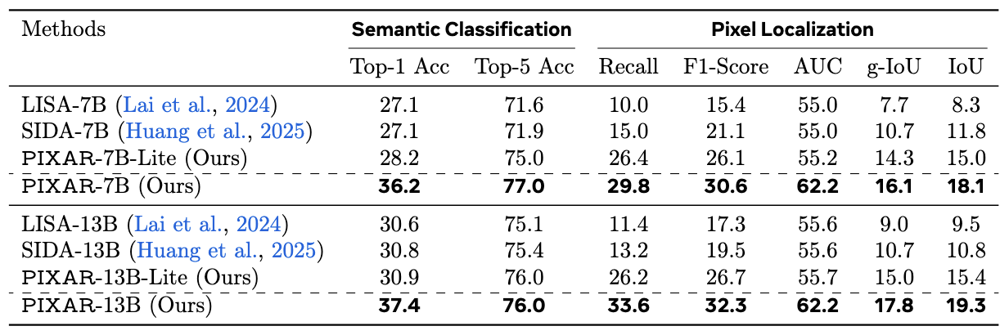

<div align="center">


# From Masks to Pixels and Meaning
### A New Taxonomy, Benchmark, and Metrics for VLM Image Tampering

<p>
  <a href=""></a>
  &nbsp;
  <a href="https://drive.google.com/drive/folders/1Zwhi403Ozy26cR1CW7EfuomFnE9qDmze?usp=drive_link"></a>
  &nbsp;
  <a href="https://huggingface.co/jiachengcui888/PIXAR-7B"></a>
  &nbsp;
  <a href="./LICENSE"></a>
</p>

<p>
  
  &nbsp;
  
  &nbsp;

</p>

<p>
<a href="https://shangxinyi.github.io/"><strong>Xinyi Shang</strong></a>*&ensp;
<a href="https://github.com/TangentOne"><strong>Yi Tang</strong></a>*&ensp;
<a href="https://jiachengcui.com/"><strong>Jiacheng Cui</strong></a>*&ensp;
<a href="https://www.linkedin.com/in/ahmed-adel-elhagry/"><strong>Ahmed Elhagry</strong></a>&ensp;
<a href="https://scholar.google.com/citations?user=TWtF0CAAAAAJ&hl=en"><strong>Salwa K. Al Khatib</strong></a><br>
<a href="https://scholar.google.com/citations?user=m10_qBQAAAAJ&hl=en"><strong>Sondos Mahmoud Bsharat</strong></a>&ensp;
<a href="https://scholar.google.com/citations?hl=en&user=_awln6YAAAAJ"><strong>Jiacheng Liu</strong></a>&ensp;
<a href="https://scholar.google.com/citations?user=PliLuD4AAAAJ&hl=en"><strong>Xiaohan Zhao</strong></a>&ensp;
<a href="https://www.homepages.ucl.ac.uk/~ucakjxu/"><strong>Jing-Hao Xue</strong></a>&ensp;
<a href="https://www.hao-li.com/Hao_Li/Hao_Li_-_about_me.html"><strong>Hao Li</strong></a>&ensp;
<a href="https://salman-h-khan.github.io/"><strong>Salman Khan</strong></a>&ensp;
<a href="https://zhiqiangshen.com/"><strong>Zhiqiang Shen</strong></a>†
</p>

<sub>* Equal contribution &emsp;|&emsp; † Corresponding author</sub>

<br><br>


<p><sub><em>Mask-based labels misalign with true edit signals (top). Our pixel-difference labels are precisely aligned with the generative footprint (bottom).</em></sub></p>

<br>

> **TL;DR** &nbsp;We expose a fundamental flaw in mask-based tampering benchmarks and introduce **PIXAR**: a 420K+ benchmark with pixel-faithful labels, 8 manipulation types, and a VLM detector that simultaneously localizes, classifies, and describes tampered regions, achieving **2.7× IoU improvement** over prior SOTA.

</div>

---

## 🔥 News

- **[2026-03]** 📦 🚀 Major Update: Code and pre-trained weights are now available, along with our large-scale PIXAR benchmark (420K+ pairs).
- **[2026-02]** 📑 Paper Status: Accepted to CVPR 2026 Findings. We have opted to withdraw it for further enhancement and resubmission.

---

## 🤗 Released Models

| Model | Base | Training Data | HuggingFace |
|:---|:---:|:---|:---:|
| **PIXAR-7B** | SIDA-7B | Full training set (`train_0.05`) | [🤗 Link](https://huggingface.co/jiachengcui888/PIXAR-7B) |
| **PIXAR-7B_lite** | SIDA-7B| Lite training set (`train_mask-only_0.05`) | [🤗 Link](https://huggingface.co/jiachengcui888/PIXAR-7B_lite) |
| **PIXAR-13B** | SIDA-13B | Full training set (`train_0.05`) | [🤗 Link](https://huggingface.co/jiachengcui888/PIXAR-13B) |
| **PIXAR-13B_lite** | SIDA-13B | Lite training set (`train_mask-only_0.05`) | [🤗 Link](https://huggingface.co/jiachengcui888/PIXAR-13B_lite) |

> **_lite** variants are fine-tuned on a subset of our training data that contains masks to guide the generation of tampered image.

---

## 📖 Overview

Existing tampering benchmarks rely on coarse object masks as ground truth, which severely misalign with the true edit signal: many pixels inside a mask are untouched, while subtle yet consequential edits outside the mask are treated as natural. We reformulate VLM image tampering from coarse region labels to a **pixel-grounded, meaning- and language-aware** task.

**PIXAR** is a large-scale benchmark and training framework with three core contributions:

1. **A new taxonomy** spanning 8 edit primitives (replace / remove / splice / inpaint / attribute / colorization, etc.) linked to the semantic class of the tampered object.
2. **A new benchmark** of over 420K training image pairs and a carefully balanced 40K test set, each with per-pixel tamper maps, semantic category labels, and natural language descriptions.
3. **A new training framework and metrics** that quantify pixel-level correctness with localization, assess confidence on true edit intensity, and measure tamper meaning understanding via semantics-aware classification and natural language descriptions.

---

## 💡 Motivation

Existing benchmarks typically rely on coarse object masks as ground truth, which often conflates unedited pixels within the mask with actual tamper evidence, while simultaneously overlooking subtle edits beyond the mask boundaries. To alleviate this, we replace binary masks with a per-pixel difference map $D = |I_{\text{orig}} - I_{\text{gen}}|$. By applying a tunable threshold $\tau$, we derive $M_\tau$, which is a dynamic ground truth that encapsulates both micro-edits at lower $\tau$ values and high-confidence semantic changes at higher $\tau$ values.

<div align="center">

<p><em>Pixel-level labels under different τ.</em></p>
</div>

---

## 📦 PIXAR Benchmark

| Split | Size | Labels |
|:---:|:---:|:---|
| Training | 420K+ image pairs | Pixel-level $M_\tau$, semantic class, text description, tampered or not |
| Test | 40K image pairs (balanced) | Pixel-level $M_\tau$, semantic class, text description, tampered or not |


---

## 🔬 Method

<div align="center">

</div>

### Architecture

Built on LLaVA + LLaMA-2 with LoRA fine-tuning, integrated with SAM ViT-H for pixel-level decoding and CLIP ViT-L/14 for visual-language alignment. Three special tokens anchor the multi-task heads in the token sequence:

| Token | Role |
|:---:|:---|
| `[CLS]` | Hidden state → 3-way classification (real / tampered) via `FC_cls` |
| `[OBJ]` | Hidden state → multi-label object recognition (81 COCO classes) via `FC_obj` |
| `[SEG]` | Hidden state fused with generated text → SAM prompt for pixel localization via `FC_seg` |

### Training Objective

$$\mathcal{L}_\text{total} = \lambda_\text{sem}\,\mathcal{L}_\text{sem} + \lambda_\text{bce}\,\mathcal{L}_\text{bce} + \lambda_\text{dice}\,\mathcal{L}_\text{dice} + \lambda_\text{text}\,\mathcal{L}_\text{text} + \lambda_\text{cls}\,\mathcal{L}_\text{cls}$$

Default weights: $\lambda_\text{sem}$ = 0.1, $\lambda_\text{cls}$ = 1.0, $\lambda_\text{bce}$ = 1.0, $\lambda_\text{dice}$ = 1.0, $\lambda_\text{text}$ = 3.0.

### Segmentation Prompt Modes

The `[SEG]` token embedding can be fused with the generated text description in three modes:

| Mode | Description |
|:---:|:---|
| `seg_only` | Uses seg_emb only |
| `text_only` | Uses text_emb only |
| `fuse` | `gate · seg_emb + (1 − gate) · text_emb`, where `gate = σ(MLP([seg_emb, text_emb]))` |

---

## 📊 Results

<div align="center">

</div>

---

## 🗂️ Project Structure

- **`model/`** — Core model (`PIXARForCausalLM`): LLaVA backbone + SAM ViT-H encoder + `[CLS]`/`[OBJ]`/`[SEG]` multi-task heads.
- **`finetune/`** — DeepSpeed training scripts for various LoRA and hyperparameter configurations.
- **`evaluation/`** — Evaluation launchers and metrics; `text_eval/compute_css.py` scores descriptions via CSS.
- **`utils/`** — Dataset class, IoU metrics, and distributed batch sampler.
- **`preprocess_raw/`** — End-to-end dataset preprocessing pipeline:
  - **`1_download-data/`** — rclone scripts to download and extract the raw PIXAR dataset from Google Drive.
  - **`2_construct_dataset/`** — Builds the dataset from raw image pairs: generates pixel-difference maps and labels at any $\tau$.
- **`train_PIXAR.py`** — Main training entry point.
- **`test_parallel.py`** — Multi-GPU parallel evaluation.
- **`chat.py`** — Interactive single-image inference.
- **`merge_lora_weights_and_save_hf_model.py`** / **`merge.sh`** — Merges LoRA adapters and exports to HuggingFace format.

---

## ⚙️ Environment Setup

**Requires Python 3.10.**

### 1. Install Dependencies

```bash
pip install -r requirements.txt
```

### 2. Fix Environment

Some packages require minor patches after installation. Run:

```bash
bash fix/fix.sh
```

If issues persist, run `fix/fix_again.sh`.

### 3. Pretrained Weights

Download the following weights and place them in your preferred directory:

| Component | Details |
|:---|:---|
| [SIDA-7B base model](https://huggingface.co/saberzl/SIDA-7B) | HuggingFace-format LLaVA-LLaMA-2 base |
| [SAM ViT-H](https://dl.fbaipublicfiles.com/segment_anything/sam_vit_h_4b8939.pth) | `sam_vit_h_4b8939.pth` |
| CLIP ViT-L/14 | `openai/clip-vit-large-patch14` (auto-downloaded) |

### 4. Pre-processed PIXAR Dataset

See the [Data](#-data) section below.

---

## 🗄️ Data

We provide two ways to obtain the PIXAR dataset:

> **Option A — Download preprocessed data (recommended)**
> Training and test sets preprocessed at $\tau$ = 0.05 are available on [Google Drive](https://drive.google.com/drive/folders/1Zwhi403Ozy26cR1CW7EfuomFnE9qDmze?usp=drive_link).
>
> The drive contains **9 files** in total:
>
> | File | Description |
> |------|-------------|
> | `train_0.05.tar.gz` | **Full training set** — includes all tampered type images |
> | `train_mask-only_0.05.tar.gz` | **Lite training set** — mask-only tampered type images only; intended for training the lite model variant |
> | `test_full_0.05.tar.gz` | **Full test set** — contains all 6 generation sources combined (see splits below) |
> | `test_qwen_0.05.tar.gz` | Test split — Qwen-generated images |
> | `test_gemini2.5_0.05.tar.gz` | Test split — Gemini 2.5-generated images |
> | `test_gemini3_0.05.tar.gz` | Test split — Gemini 3-generated images |
> | `test_flux2_0.05.tar.gz` | Test split — FLUX 2-generated images |
> | `test_gpt_0.05.tar.gz` | Test split — GPT-generated images |
> | `test_seedream_0.05.tar.gz` | Test split — SeeDream-generated images |
>
> `test_full_0.05.tar.gz` aggregates all 6 per-source test splits (qwen, gemini2.5, gemini3, flux2, gpt, seedream).

> **Option B — Build from raw data with a custom $\tau$**
> We release the raw image pairs alongside the pixel-difference maps, allowing labels to be re-derived at any $\tau$. See [Custom Dataset Processing](#custom-dataset-processing) for details.

### Dataset Format

```
dataset_dir/
├── train/
│   ├── real/               # Authentic images
│   ├── full_synthetic/     # fully generated (empty)
│   ├── tampered/           # AI-Tampered images
│   ├── masks/              # masks used to generate the tampered images
│   ├── soft_masks/         # Pixel-difference maps M_τ (default τ = 0.05)
│   └── metadata/           # JSON per tampered image: {"cls": [...], "text": "..."}
└── validation/
    └── (same structure)
```

### Custom Dataset Processing

If you want to build the dataset from scratch at a different $\tau$, follow these two steps.

**Step 1 — Download raw data**

Follow [`preprocess_raw/1_download-data/README.md`](./preprocess_raw/1_download-data/README.md) to configure rclone, populate `preprocess_raw/1_download-data/files.txt` with the raw zip filenames, and run:

```bash
bash preprocess_raw/1_download-data/download.sh
```

**Step 2 — Build dataset at your preferred $\tau$**

Edit the config block in `preprocess_raw/2_construct_dataset/generate_v2.sh`:

```bash
DATASET_DIR="/path/to/raw_outputs"   # output of download.sh
OUT_DIR="/path/to/output_dataset"    # where to write the processed dataset
TAOS=(0.05)                          # e.g. (0.01) (0.1) (0.2) or multiple values
```

Then run:

```bash
cd preprocess_raw/2_construct_dataset

bash generate_v2.sh          # mask-only labels
bash generate_v2-text.sh     # labels + text descriptions (requires descriptions.csv)
```

**$\tau$ selection guide:**

| $\tau$ | Effect |
|:---:|:---|
| 0.01 | Captures micro-edits and subtle pixel changes |
| **0.05** | **Default — balanced sensitivity (recommended)** |
| 0.1 | High-confidence semantic changes only |
| 0.2 | Conservative — only large, obvious edits |

---

## 🚀 Training

You can launch training directly or use the provided scripts under `finetune/`:

```bash
deepspeed --include localhost:0 --master_port=12345 train_PIXAR.py \
  --version <path_to_base_model> \
  --dataset_dir <path_to_dataset> \
  --vision_pretrained <path_to_sam_vit_h.pth> \
  --val_dataset <path_to_validation_set> \
  --batch_size 2 --epochs 10 --steps_per_epoch 1000 \
  --lr 1e-4 --dice_loss_weight 1.0 --seg_prompt_mode seg_only \
  --precision bf16 --exp_name "pixar_experiment" --log_base_dir ./runs
```

Key hyperparameters: LoRA rank 8, $\lambda_\text{dice}$ = 1.0, $\lambda_\text{sem}$ = 0.1, $\lambda_\text{text}$ = 3.0, $\tau$ = 0.05.

### Merging LoRA Weights

After training, convert the DeepSpeed checkpoint and merge LoRA adapters before evaluation:

```bash
# Step 1: Convert DeepSpeed checkpoint to fp32
cd runs/<exp_name>/ckpt
python zero_to_fp32.py . ../pytorch_model.bin

# Step 2: Merge LoRA adapters into the base model
# Set the path to pytorch_model.bin in merge.sh, then run:
bash merge.sh
```

---

## 📐 Evaluation

See [`evaluation/README.md`](./evaluation/README.md) for the full guide.

```bash
# Multi-GPU parallel evaluation
python test_parallel.py \
  --version <merged_model> --dataset_dir <test_data> \
  --vision_pretrained <sam.pth> --gpus 0,1,2,3 \
  --output_dir ./evaluation/logs/my_exp \
  --seg_prompt_mode seg_only --precision bf16 --save_generated_text

# Text quality (CSS score, requires --save_generated_text above)
cd evaluation/text_eval
python compute_css.py \
  --json_path ../logs/my_exp/generated_texts.json \
  --output_path ./logs/my_exp/css_scores.json
```

---

## 💬 Interactive Inference

```bash
python chat.py --version <merged_model> --precision bf16 --seg_prompt_mode seg_only
```

We also provide a set of demo notebooks in the [`playground/`](playground/) directory that you can use to explore the model interactively.

---

## 📝 Citation

If you find this work useful, please cite:

```bibtex

```
